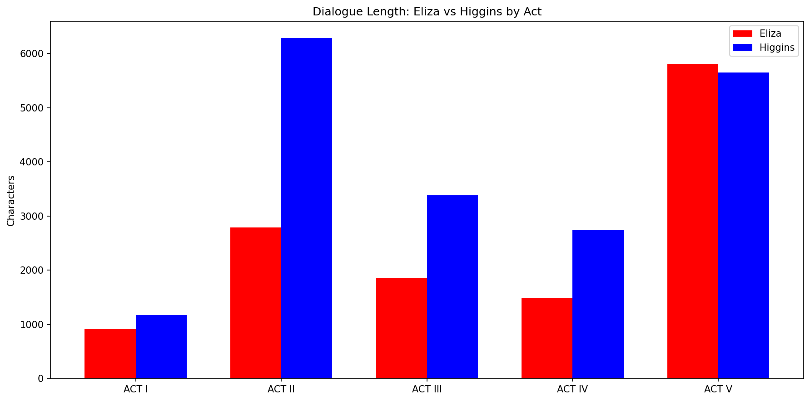

# Pygmalion: An NLP Analysis
## Can data analysis show when Eliza Doolittle finds her voice?

## Overview
This project analyses the play Pygmalion by Bernard Shaw using Natural Language Processing (NLP) techniques to visualise how Eliza's voice changes from her meeting with Professor Higgins at London’s Covent Garden flower market through to his 'educating of her' at his home on Wimple Street and her final departure. Using dialogue extraction and sentiment analysis, the data reveals the moment Eliza's voice becomes her own and her speech overtakes Higgins for the first time in Act V.

## Key Findings
- Eliza speaks more than Higgins for the first time in Act V — 
the data shows her finding her voice
- Eliza feels everything more intensely than Higgins — 
her sentiment scores swing far more dramatically than his
- Both characters peak emotionally in Act II — the only moment 
of alignment between them

## Visualisations

### Dialogue Length by Act

### Sentiment Analysis by Act

## Techniques Used
- Dialogue extraction by character and Act
- Sentiment Analysis (TextBlob)
- Collocate Analysis

## Libraries
- Python, BeautifulSoup, NLTK, TextBlob, Matplotlib

## Data Source
- Project Gutenberg: Pygmalion by George Bernard Shaw
